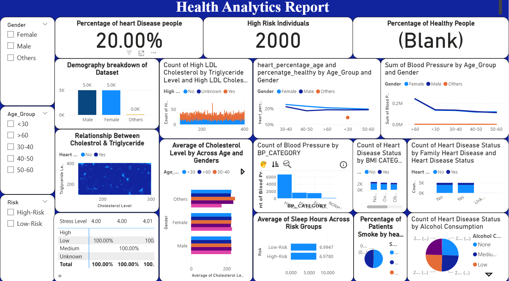

# 🏥 Health Disease Dashboard | Power BI

<p align="center">


</p>

---

# 📌 Project Overview

The **Health Disease Dashboard** is an interactive **Power BI** dashboard developed to analyze patient health records, disease patterns, demographic distribution, and healthcare insights.

This dashboard transforms raw healthcare data into meaningful visualizations, enabling users to monitor key health indicators, identify disease trends, and support data-driven healthcare decisions.

---

# 🎯 Business Objectives

✅ Analyze patient demographics

✅ Monitor disease distribution

✅ Identify high-risk patient groups

✅ Track healthcare trends

✅ Build an interactive healthcare dashboard

---

# 🛠️ Tech Stack

| Tool | Usage |
|------|-------|
| Power BI | Dashboard Development |
| Power Query | Data Transformation |
| DAX | Calculations & Measures |
| CSV Dataset | Data Source |
| Data Modeling | Relationship Building |
| Interactive Visuals | Business Insights |

---

# 📊 Dashboard KPIs

| KPI | Description |
|------|------------|
| 👥 Total Patients | Number of Patient Records |
| 🩺 Disease Cases | Total Diagnosed Cases |
| 👨 Male Patients | Male Patient Count |
| 👩 Female Patients | Female Patient Count |
| 📈 Disease Distribution | Category-wise Analysis |

---

# 📈 Dashboard Features

📊 Patient Demographics Analysis

🩺 Disease Distribution

👨‍⚕️ Gender-wise Analysis

🎂 Age Group Analysis

📍 Health Trends

📌 KPI Cards

🎛 Interactive Filters & Slicers

📉 Dynamic Charts & Visualizations

---

# 💡 Key Insights

✔ Identified the most common diseases among patients.

✔ Analyzed disease occurrence across different age groups.

✔ Compared patient distribution by gender.

✔ Monitored healthcare trends through interactive visualizations.

✔ Built a dynamic dashboard for healthcare reporting and analysis.

---

# 🚀 Business Impact

- Improved healthcare data visualization.
- Simplified patient record analysis.
- Enabled faster medical reporting.
- Supported data-driven healthcare decisions.
- Enhanced understanding of disease patterns.

---

# 📷 Dashboard Preview

<p align="center">



</p>

---

# 📂 Repository Structure

```text
📁 Health-Disease-Dashboard-using-PowerBI
│
├── 📄 README.md
├── 📊 Health Disease Dashboard.pbix
├── 📄 health1.csv
├── 📷 Screenshot 2025-08-01 123036.png
│
└── 📁 images
      └── 🖼️ Health_Disease_Dashboard.png
```

---

# ⭐ Skills Demonstrated

- Power BI
- Power Query
- DAX
- Data Cleaning
- Data Transformation
- Data Modeling
- Dashboard Design
- Data Visualization
- KPI Reporting
- Business Intelligence

---

# 📌 Key Learnings

- Built an interactive healthcare dashboard using Power BI.
- Applied data modeling and DAX for meaningful analysis.
- Designed KPI-driven visualizations for healthcare reporting.
- Improved analytical and visualization skills.
- Converted raw healthcare data into actionable insights.

---

## 👨‍💻 Author

### **Vinay Siddharudh Thisake**

**Data Analyst | Power BI | SQL | Python | Excel | Salesforce**

---

⭐ **If you found this project useful, don't forget to Star this repository!**


